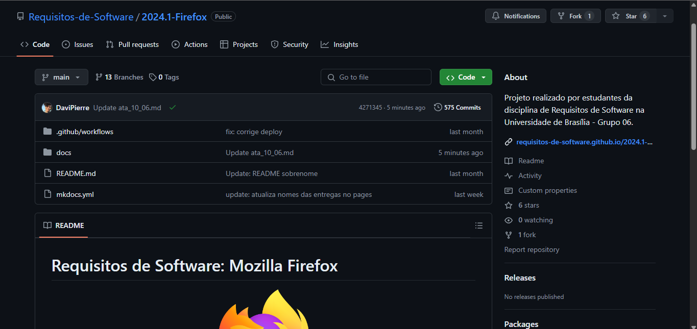
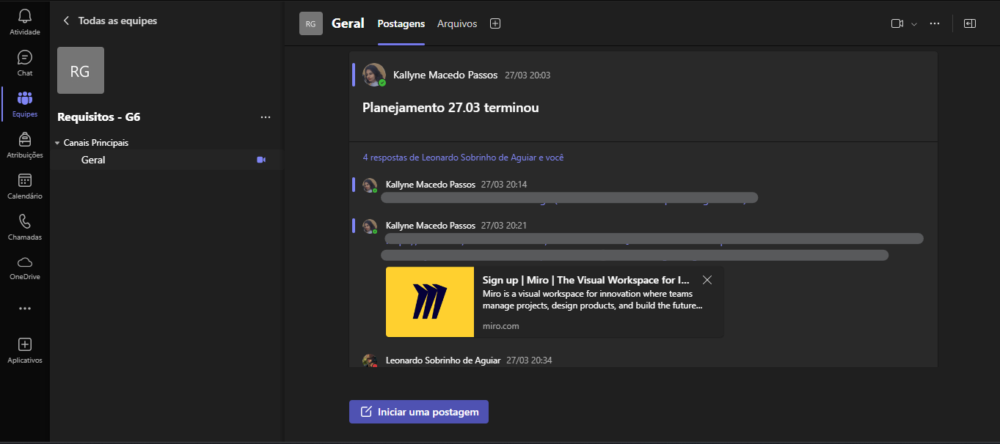

# Ferramentas utilizadas

## Introdução
Neste artefato, busca-se relacionar todas as ferramentas trabalhadas ao longo do projeto ao propósito que serviram e identificar como apoiaram o desenvolvimento das análises realizadas desde a etapa de Planejamento até a Validação.

## Ferramentas

Na tabela abaixo, é apresentada uma relação consolidada das ferramentas utilizadas ao longo do projeto. 

**Tabela 1**: Ferramentas

| Ferramentas                    | Uso Realizado                                                           | Etapa                                                                                                                         |
|--------------------------------|-------------------------------------------------------------------------|-------------------------------------------------------------------------------------------------------------------------------|
| **GitHub**                     | Versionamento e armazenamento do projeto da disciplina                  | Planejamento, Pré-Rastreabilidade, Elicitação, Modelagem, Modelagem Ágil, Pós-Rastreabilidade, Verificação, Validação e Final |
| **Microsoft Teams**            | Gravação de reuniões, apresentações do grupo e validações com o usuário | Planejamento, Pré-Rastreabilidade, Elicitação, Modelagem, Modelagem Ágil, Pós-Rastreabilidade, Verificação, Validação e Final |
| **Visual Studio Code**         | Criação e edição de arquivos do projeto                                 | Planejamento, Pré-Rastreabilidade, Elicitação, Modelagem, Modelagem Ágil, Pós-Rastreabilidade, Verificação, Validação e Final |
| **Youtube**                    | Compartilhamento de gravações das reuniões e apresentações da equipe    | Planejamento, Pré-Rastreabilidade, Elicitação, Modelagem, Modelagem Ágil, Pós-Rastreabilidade, Verificação, Validação e Final |
| **Whatsapp**                   | Principal ferramenta de comunicação da equipe                           | Planejamento, Pré-Rastreabilidade, Elicitação, Modelagem, Modelagem Ágil, Pós-Rastreabilidade, Verificação, Validação e Final |
| **Miro**                       | Organização e cronograma da equipe, visualização dos requisitos         | Planejamento, Elicitação                                                                                                      |
| **MkDocs**                     | Criação do GitPages do projeto                                          | Planejamento                                                                                                                  |
| **Microsoft Whiteboard**       | Ferramenta para criação do Rich Picture                                 | Pré-Rastreabilidade                                                                                                           |
| **This Person Does Not Exist** | Imagens de pessoas geradas por IA para representar personas             | Elicitação                                                                                                                    |
| **Mural**                      | Visualização dos requisitos para priorização                            | Elicitação                                                                                                                    |
| **Google Meet**                | Gravação de entrevistas                                                 | Elicitação                                                                                                                    |
| **Lucid Chart**                | Diagramação UML de artefatos                                            | Modelagem, Modelagem Ágil                                                                                                     |
| **Figma**                      | Prototipação de requisitos não implementados                            | Validação                                                                                                                     |
| **Outlook**                    | Comunicação de comprovação informal                                     | Validação                                                                                                                     |

**Autor**: [Kallyne Macedo](http://github.com/kalipassos), 2024.

### Aplicação das ferramentas

[O repositório GitHub da disciplina](https://github.com/Requisitos-de-Software/2024.1-Firefox/) contém toda a documentação correspondente ao projeto, sendo possível visualizar também o versionamento de cada artefato e as mudanças realizadas ao longo do tempo. O repositório pode ser acessado a qualquer momento através do botão no canto superior direito da página. 

**Figura 1**: Repositório GitHub do grupo - Firefox

**Autor**: [Kallyne Macedo](http://github.com/kalipassos), 2024.

No [Microsoft Teams](https://learn.microsoft.com/en-us/microsoftteams/), foi criada uma equipe privada aos membros do grupo para a realização de reuniões.

**Figura 2**: Equipe Teams de desenvolvimento do projeto

**Autor**: [Kallyne Macedo](http://github.com/kalipassos), 2024.

O [Visual Studio Code](https://code.visualstudio.com/docs) foi a ferramenta de edição de código escolhida pelo grupo por motivos de famialiaridade e compatibilidade nativa com arquivos markdown, composição principal do projeto. Além disso, através da ferramenta, é possível rodar o [MkDocs](https://www.mkdocs.org/), framework gerador de páginas no GitHub e assim visualizar o resultado final dos artefatos. 

No [Miro](https://miro.com/pt/), foi criado um layout de cronograma para a organização das primeiras etapas do projeto, além de ter sido utilizado como ferramenta em parte da [priorização dos requisitos](../elicitacao/priorizacao/requisitos_priorizados.md) e elaboração do [diagrama de casos de uso](../modelagem/casos_de_uso/casos_de_uso.md).

**Figura 3**: Cronograma Planejado no Miro

**Autor**: [Kallyne Macedo](http://github.com/kalipassos), 2024.

O [Mural](https://www.mural.co/), ferramenta semelhante ao Miro, foi utilizado também na [priorização dos requisitos](../elicitacao/priorizacao/requisitos_priorizados.md).

O [Microsoft Whiteboard](), também semelhante ao Miro, foi utilizado na elaboração do [Rich Picture](../pre-rastreabilidade/rich-picture.md).

O [Lucid Chart](https://lucid.app/documents), ferramenta de diagramação, foi utilizada na criação do [NFR Framework](../modelagem_agil/NFR%20Framework.md).

O [This Person Does Not Exist](https://thispersondoesnotexist.com/), site de geração de rostos por IA, foi utilizado para gerar imagens representativas das personas do projeto.

O [Google Meet](https://meet.google.com/), ferramenta de reuniões online síncronas e instantâneas, foi utilizado também para registro de vídeos realizados principalmente com usuários externos à disciplina, por ser de mais fácil acesso do que o Microsoft Teams, em etapas como a [elicitação de requisitos por entrevista](../elicitacao/tecnicas/entrevista.md).  

**Video 1**: Entrevista de Elicitação com Nathália

<iframe width="560" height="315" src="https://www.youtube.com/embed/1FsLuImzNow?si=BQpnzOy01gUifS3P" title="YouTube video player" frameborder="0" allow="accelerometer; autoplay; clipboard-write; encrypted-media; gyroscope; picture-in-picture; web-share" referrerpolicy="strict-origin-when-cross-origin" allowfullscreen></iframe>

**Autor:** [Kauan Eiras](https://github.com/kauaneiras), 2024.

O [YouTube](https://www.youtube.com/), demonstrado acima, foi utilizado como ferramenta de armazenamento de todos os vídeos registrados no decorrer do projeto. Todos os vídeos foram classificados como não listados, e podem ser encontrados ao decorrer dos artefatos.

O [WhatsApp](https://developers.facebook.com/docs/whatsapp/?locale=pt_BR), ferramenta de comunicação instantânea, foi utilizado para conversas, resolução de dúvidas e organização de reuniões ao longo do projeto, através da participação dos membros em um grupo. 

O [Figma](https://www.figma.com/) foi a ferramenta de prototipação escolhida para o desenvolvimento das telas de funcionalidades ainda não implementadas no app Firefox. Através dele, foi possível prototipar em alta fidelidade, simulando as interações entre as páginas. 

**Embed 1**: Protótipo de telas não implementadas no app Firefox

<iframe style="border: 1px solid rgba(0, 0, 0, 0.1);" width="800" height="450" src="https://www.figma.com/embed?embed_host=share&url=https%3A%2F%2Fwww.figma.com%2Fdesign%2FZujNRuuqHSdLu11XzDQNMJ%2FFirefox---Requisitos%3Fnode-id%3D0-1%26t%3DfVWDDn5JbXfgT5X4-1" allowfullscreen></iframe>

**Autor**: [Kallyne Macedo](http://github.com/kalipassos), 2024.

Por fim, o [Outlook](https://outlook.office.com/), ferramenta de e-mail, foi utilizado para estabelecer comunicação com os mantenedores do app Firefox, de forma a convidá-los a gerar feedback para o projeto.

## Conclusão

Ao longo do projeto, em conformidade com o ritmo de estudo e de repasse do conteúdo, foram utilizadas mais ferramentas do que o planejado inicialmente. Dessa forma, por familiaridade dos membros do grupo com recursos específicos, algumas ferramentas com funcionalidade similar foram utilizadas concomitantemente, mas sempre em processos diferentes, de forma a manter a padronização nos documentos. Apesar disso, as ferramentas utilizadas foram fundamentais para o desenvolvimento do projeto, proporcionando melhorias na capacidade de desenvolvimento e de detalhamento na confecção dos artefatos.

## Referências

1. GitHub. Disponível em: https://docs.github.com/pt. Acesso em: 28 de mar. de 2024.
2. Microsoft Teams. Disponível em: https://learn.microsoft.com/en-us/microsoftteams/. Acesso em: 28 de mar. de 2024.
3. Youtube. Disponível em: https://www.youtube.com/. Acesso em: 28 de mar. de 2024.
4. Miro. Disponível em: https://miro.com/pt/. Acesso em: 28 de mar. de 2024.
5. Visual Studio Code. Disponível em: https://code.visualstudio.com/docs. Acesso em: 28 de mar. de 2024.
6. MkDocs. Disponível em: https://www.mkdocs.org/. Acesso em: 28 de mar. de 2024.
7. Whatsapp. Disponível em: https://developers.facebook.com/docs/whatsapp/?locale=pt_BR. Acesso em 31 de mar. 2024.
8. Microsoft Whiteboard. Disponível em: https://www.microsoft.com/pt-br/microsoft-365/microsoft-whiteboard/digital-whiteboard-app. Acesso em 31 de mar. 2024.
9. Figma. Disponível em: https://www.figma.com/. Acesso em 07 de jul. 2024.
10. Mural. Disponível em: https://www.mural.co/. Acesso em 07 de jul. 2024.
11. Google Meet. Disponível em: https://meet.google.com/. Acesso em 07 de jul. 2024.
12. Lucid Chart. Disponível em: https://lucid.app/documents. Acesso em 07 de jul. 2024.
13. This Person Does Not Exist. Disponível em: https://thispersondoesnotexist.com/. Acesso em 07 de jul. 2024.
14. Outlook. Disponível em: https://outlook.office.com/. Acesso em 07 de jul. 2024.

## Histórico de versão

| Versão | Data       | Descrição              | Autor                                           | Revisor                                          |
|--------|------------|------------------------|-------------------------------------------------|--------------------------------------------------|
| 1.0    | 03/07/2024 | Criação da página      | [Guilherme Westphall](https://github.com/west7) | [Kallyne Macedo](http://github.com/kalipassos)   |
| 1.1    | 08/07/2024 | Adição das ferramentas | [Kallyne Macedo](http://github.com/kalipassos)  | [Leonardo Aguiar](https://github.com/Leonardo0o) |