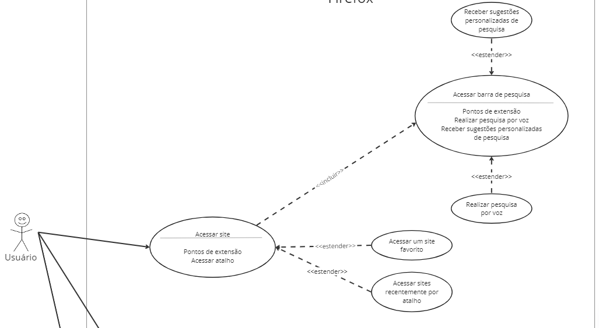
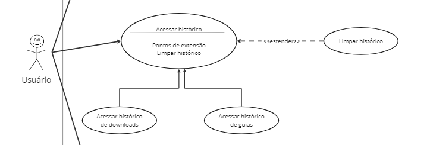

# Validação de Casos de Uso

## Introdução

A validação dos casos de uso busca avaliar a conformidade da diagramação e especificação dos casos de uso, realizados na etapa de modelagem de requisitos, com as necessidades do cliente ou das personas, o que torna esse processo parte essencial para entender se os requisitos do sistema estão sendo atingidos ou não e o que pode ser feito para aprimorar a usabilidade.

## Metodologia

Para essa validação, foram observadas as necessidades e experiência de uso atribuídas à persona Ronaldo. Assim, foram observados os casos de uso mais relevantes para a persona em questão, de modo a estimular a análise e possível revisão da especificação.

## Validação

### Realizar pesquisa na Web.

A especificação do caso de uso de Realizar pesquisa na Web possui um fluxo principal, um fluxo alternativo, em que o usuário recebe sugestões de pesquisa, e um fluxo de exceção em que o resultado não é encontrado. No diagrama, o caso de uso conta com duas relações de inclusão.

Figura 1 - Caso de Uso - Realizar pesquisa na Web

Fonte: [Kallyne Macedo](https://github.com/kalipassos), 2024

Para a persona que busca um navegador em que possa fazer pesquisas para estudos da faculdade, o fluxo principal atende as necessidades e a possibilidade de sugestão de pesquisa facilita seu dia a dia.

### Acessar site 

A especificação do caso de uso de Acessar site possui um fluxo principal, dois fluxos alternativo, em que o usuário pode acessar um atalho ou um site favoritado, e um fluxo de exceção em. No diagrama, o caso possui duas extensões e uma inclusão (com o caso de uso Acessar barra de pesquisa).

Figura 2 - Caso de Uso - Acessar site

Fonte: [Kallyne Macedo](https://github.com/kalipassos), 2024

Para Ronaldo, que tem como objetivo navegar diariamente na Internet, a possibilidade de manter sites nos favoritos e criar atalho das páginas atendem sua necessidade. 

### Bloquear anúncios

A especificação do caso de uso de Bloquear anúncio possui um apenas um fluxo principal, em que o usuário tem como ação primária a habilidade de bloquear todos os anúncios da página. Como a persona busca segurança e um dos aspectos que vê como importante na navegação é a possibilidade de bloquear anúncios, o fluxo o atende parcialmente pois ainda falta a opção de bloquear downloads não confiáveis. 

### Acessar histórico

A especificação do caso de uso de Acessar histórico possui um fluxo principal, onde o usuário apenas faz o acesso ao histórico de guias, e três fluxos alternativos, nos quais o usuário faz o acesso ao histórico de downloads, limpa o histórico de guias e limpa o histórico de downloads. Nesse caso de uso, não tem um fluxo de exceção. No diagrama, o caso possui uma extensão e duas especializações. 

Figura 3 - Caso de Uso - Acessar histórico

Fonte: [Kallyne Macedo](https://github.com/kalipassos), 2024

Para a persona que busca um navegador em que possa fazer pesquisas para estudos da faculdade, downloads de documentos para estudo e ao mesmo tempo tem que manter as referências para seus estudos, o fluxo principal atende as necessidades e os alternativos o auxiliam ao darem mais opções para o usuário.

## Histórico de versões

| Versão | Data       | Descrição         | Autor                                           | Revisor |
| ------ | ---------- | ----------------- | ----------------------------------------------- | ------- |
| 1.0    | 20/05/2024 | Criação da página | [Kallyne Macedo](https://github.com/kalipassos) |  [Leonardo Aguiar](https://github.com/Leonardo0o0)    |
| 1.1    | 20/05/2024 | Validação do histórico | [Leonardo Aguiar](https://github.com/Leonardo0o0) | [Kallyne Macedo](https://github.com/kalipassos)  |