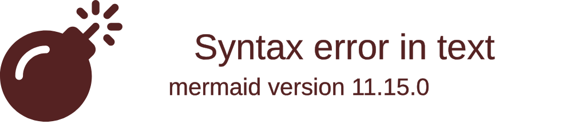

# Contribuição

## Introdução

Este documento tem como objetivo apresentar as diretrizes para contribuição no projeto.

## Commit

### Mensagem de Commit

Os commits devem seguir o padrão de mensagem definido a seguir:

```plaintext
<tipo>: <descrição>
```

Onde `<tipo>` é um dos seguintes:

- **new**: novo documento
- **update**: atualização de documento
- **fix**: correção 
- **delete**: remoção


E `<descrição>` é um breve texto que deve começar com um verbo no presente do indicativo, descrevendo o que foi feito. Exemplo:

```plaintext
new: adiciona elicitacao de requisitos
```

### Regra de Commit

É importante notar que não são permitidos commits diretos na branch `main`. Todos os commits devem ser feitos em uma branch de desenvolvimento e, em seguida, mesclados na `main` através de um pull request, conforme ilustrado na Figura 1. Isso ajuda a manter a integridade da `main` e permite que as alterações sejam revisadas antes de serem incorporadas ao projeto.

<center>

**Figura 1:** Fluxo de trabalho com branches de desenvolvimento.



**Autor:** [Lucas Martins](https://github.com/martinsglucas), 2024.

</center>


## Branches

### Branch Prinicpal

A branch principal do projeto é a `main`. Nela estão presentes os artefatos que estão finalizados e prontos para serem entregues.

### Branches de Desenvolvimento

As branches de desenvolvimento devem seguir o padrão de nomenclatura definido a seguir:

```plaintext
<entregaX>/<artefato>
```

Onde `<entregaX>` é uma das entregas previstas no plano de ensino e `<artefato>` é o artefato que está sendo desenvolvido. Exemplo:

```plaintext
entrega2/priorizacao-moscow
```

## Pull Request

Os Pull Requests (PRs) são a forma de submeter alterações para serem revisadas antes de serem incorporadas ao projeto. Eles devem seguir as seguintes regras:

- O título do PR deve seguir o padrão de nomenclatura das branches de desenvolvimento.
<!-- - O corpo do PR deve conter uma descrição detalhada das alterações realizadas. -->
- O PR só pode ser mesclado após a aprovação de, no mínimo, um membro do time.

## Páginas

As páginas do projeto devem seguir o padrão [Exemplo.md](./exemplo.md).

## Histórico de Versões

| Versão |    Data    | Descrição                                       |                      Autor                      |                     Revisor                     |
| :----: | :--------: | ----------------------------------------------- | :---------------------------------------------: | :---------------------------------------------: |
|  1.0   | 30/04/2024 | Criação do documento de contribuição |  [Lucas Martins](https://github.com/martinsglucas)   | [Kallyne Macedo](https://github.com/kalipassos) |