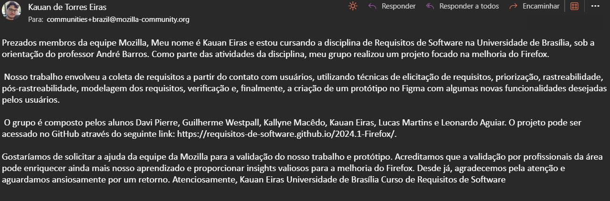

# Validação dos Artefatos e do Protótipo

## Introdução

A validação dos artefatos e do protótipo é uma etapa importante do processo de desenvolvimento de software, pois é nela que se verifica se o que foi desenvolvido atende aos requisitos do projeto. A validação é feita por meio de testes, que podem ser manuais ou automatizados, entrevistas com usuários e outras técnicas.

## Metodologia

O processo de validação dos artefatos desenvolvidos ao longo do semestre foi feito por meio do contato com a Mozilla Foundation, que é a organização responsável pelo desenvolvimento do Firefox. Enviamos um e-mail para a equipe de desenvolvimento do Firefox, explicando o projeto e solicitando feedback sobre os artefatos desenvolvidos. E para a validação dos requisitos não implementados utilizamos o **Protótipo** feito através do **Figma**. 

**Protótipo**: Requisitos não implementadoss Firefox

<iframe style="border: 1px solid rgba(0, 0, 0, 0.1);" width="600" height="450" src="https://www.figma.com/embed?embed_host=share&url=https%3A%2F%2Fwww.figma.com%2Fproto%2FZujNRuuqHSdLu11XzDQNMJ%2FFirefox---Requisitos%3Fnode-id%3D60-511%26t%3DqFyVOfCatZmOfZhD-1%26scaling%3Dmin-zoom%26content-scaling%3Dfixed%26page-id%3D0%253A1%26starting-point-node-id%3D1%253A42" allowfullscreen></iframe>

## Validação 1 - Tarefas Agrupar Guias e Bloquear Anúncios

A validação das tarefas agrupar guias e bloquear anúncios foi realizada no dia 01/07/2024, por meio da plataforma Microsoft Teams, com a usuária do Firefox Júlia Gabriela. Ela realizou o que considerou como caminho feliz no protótipo e depois respondeu os critérios de aceitação das histórias de usuário referente aos requisitos correspondentes. A usuária apresentou dificuldade inicial de realizar as tarefas mas conseguiu finalizar cada fluxo e não apontou nenhum feedback. Abaixo, segue o vídeo da validação.

Vídeo 1: Validação Protótipo

Autor: [Kauan Eiras](https://github.com/kauaneiras) 

## Validação 2 - Todas as tarefas

A validação foi realizada no dia 01/07/2024, por meio da plataforma Microsoft Teams, com o usuário do Firefox Júlio Roberto. Ele realizou a seguinte 

- Agrupar guias
- Sincronizar conta Google
- Alterar fonte em tipo e tamanho 
- Controle Parental
- Bloqueio de Anúncios 
- VPN

## Referências

## Histórico de versão